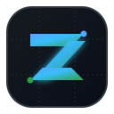
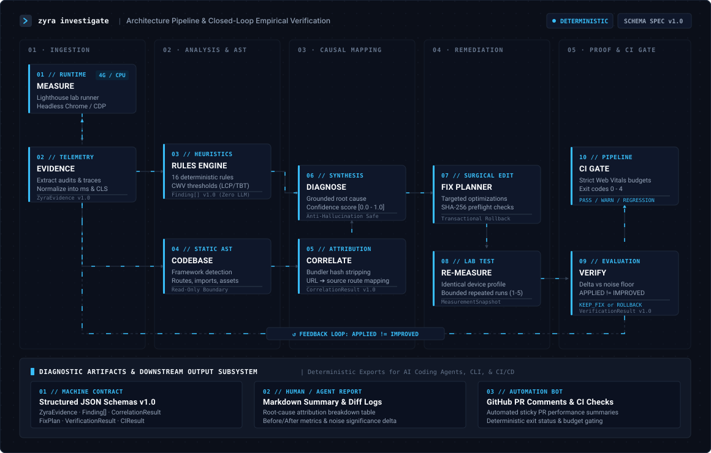

<p align="center">
  <a href="#readme">
    
  </a>
</p>

<h1 align="center">ZYRA</h1>

<p align="center">
  <strong>Agent-native web performance investigation and optimization tool.</strong>
</p>

<p align="center">
  <a href="https://github.com/username/zyra/actions"></a>
  <a href="package.json"></a>
  <a href="package.json"></a>
  <a href="tests"></a>
  <a href=".context/CURRENT_STATE.md"></a>
  <a href="LICENSE"></a>
</p>

<p align="center">
  ZYRA bridges the divide between real-world browser telemetry and application source code.<br />
  It enables developers and AI coding agents to empirically diagnose performance bottlenecks, trace them to root causes in the codebase, apply surgical fixes, verify gains through re-measurement, and gate CI regressions.
</p>

---

## Investigation Graph & Feedback Loop

ZYRA does not follow a blind, linear checklist. Performance investigation is modeled as an **evidence graph and verification loop** that connects browser telemetry with static codebase intelligence, planning safe interventions and requiring empirical before-and-after proof.

<p align="center">
  
</p>

### Investigation Stages

| Stage | Subsystem | Purpose & Guarantees |
| :--- | :--- | :--- |
| **MEASURE** | `src/lighthouse/` | Runs Lighthouse and captures browser performance measurements under controlled lab conditions (mobile 4G throttling or desktop). |
| **EVIDENCE** | `src/evidence/` | Normalizes metrics, audits, resources, scripts, images, fonts, and long tasks into standardized units (ms) under `ZyraEvidence` Schema v1.0. |
| **RULES** | `src/rules/` | Applies deterministic thresholds and performance rules across 16 built-in heuristics with zero LLM guesswork. |
| **CODEBASE** | `src/codebase/` | Safely inspects framework, routes, imports, assets, configuration, and project structure via read-only AST traversal. |
| **CORRELATE** | `src/correlation/` | Connects browser evidence with relevant codebase evidence via bundler hash stripping, asset resolution, and dynamic route matching. |
| **DIAGNOSE** | `src/correlation/` | Distinguishes observed facts, contributors, supported causes, and uncertainty with bounded confidence scores `[0.0, 1.0]`. |
| **FIX** | `src/fixes/` | Creates constrained, safe, reversible fix plans guarded by preflight checks, SHA-256 optimistic concurrency, and transactional rollback. |
| **RE-MEASURE** | `src/verification/` | Measures again after changes under identical lab conditions and device profiles. |
| **VERIFY** | `src/verification/` | Determines improvement, regression, or inconclusive results against deterministic noise-significance floors (`APPLIED != IMPROVED`). |
| **CI** | `src/ci/` | Detects performance regressions deterministically in automation, enforces Web Vitals budgets, and sets standard exit codes (0–4). |

<details>
<summary><strong>Explore Multi-Path Evidence Routing &amp; Feedback Loop</strong></summary>

```text
    MEASURE (Lighthouse Telemetry)
       │
       ▼
    EVIDENCE (Normalized Schema v1.0)
       │
       ├──────────────────────────────────────────┐
       ▼                                          ▼
     RULES (16 Deterministic Rules)            CODEBASE (Read-Only AST & Routes)
       │                                          │
       │                                          ▼
       │                                      CORRELATE (Multi-Signal Attribution)
       │                                          │
       └────────────────────┬─────────────────────┘
                            ▼
                         DIAGNOSE (Attributed Root Cause + Confidence)
                            │
                            ▼
                           FIX (Safe, Reversible Modifications)
                            │
                            ▼
                        RE-MEASURE (Identical Test Environment)
                            │
                            ▼
                          VERIFY (Noise Filtering & Delta Calculation)
                            │
            ┌───────────────┴───────────────┐
            ▼                               ▼
       [Improvement]               [Regression / Noise]
            │                               │
            ▼                               ▼
      CI REGRESSION GATE           EMPIRICAL FEEDBACK LOOP
     (Pass / Fail / Warn)             (Rollback or Refine)
```

1. **Dual Evidence Branching:** From `EVIDENCE`, telemetry streams into deterministic performance rules (`RULES`) while codebase traversal (`CODEBASE`) maps entry points, dependencies, and assets.
2. **Convergence into Diagnosis:** `RULES` and `CORRELATE` converge at `DIAGNOSE` to ensure root-cause attribution is grounded in both runtime evidence and static source code.
3. **Verification Feedback Loop:** `VERIFY` compares post-fix measurements to baseline evidence. If a metric regresses or is within the noise floor, ZYRA recommends rollback or revision. Changes are only committed when empirical gains are proven.
</details>

---

## What ZYRA Does

### The Problem
* **Lighthouse & PSI are disconnected from code:** They report that LCP is 4.2s or that 1.2MB of unused JavaScript was transferred, but cannot identify which component, route handler, or import caused the issue.
* **Generic AI assistants hallucinate optimizations:** Without empirical runtime telemetry, assistants guess at bottlenecks, refactoring code that has zero measurable impact or introducing silent functional regressions.

### The Solution
ZYRA operates directly inside your development environment, uniting live browser telemetry with static codebase intelligence:

* **Evidence First:** Captures raw Lighthouse telemetry, normalizing metrics into uniform millisecond units, extracting resource transfer sizes, script execution timings, and layout shifts.
* **Deterministic Rules:** Evaluates 16 programmatic rules with thresholds grounded in Google Web Vitals criteria. No hallucinations, no subjective opinions.
* **Safe Codebase Scanning:** Inspects frameworks (Next.js App/Pages, Nuxt, SvelteKit, Astro, Vite, Angular), static/dynamic routes, dependency graphs, and assets. Execution is strictly read-only with workspace boundary enforcement.
* **Multi-Signal Correlation:** Links runtime anomalies (e.g. slow LCP image, unminified script, layout shift) to exact source files, layouts, and configuration entries.
* **Safe, Reversible Fixes:** Generates structured `FixPlan`s with preflight checks and SHA-256 optimistic concurrency guards. Fixes can be dry-run safely, and automatically roll back on failure.
* **Empirical Verification:** Enforces the foundational invariant: **`APPLIED != IMPROVED`**. A fix is only successful when post-fix measurements verify a delta exceeding the noise floor.
* **CI Regression Gating:** Automates baseline comparison and Core Web Vitals budget enforcement in pull request pipelines with deterministic exit codes.

---

## Real Workflow Example

A complete end-to-end performance investigation and remediation workflow:

```bash
# 1. Investigate and correlate runtime telemetry with target workspace
zyra analyze https://app.example.com --workspace ./target-app
```

```text
============================================================
 ZYRA — Investigation Summary
============================================================
 URL:         https://app.example.com
 Profile:     mobile
 Timestamp:   2026-09-11T12:00:00.000Z

 Core Web Vitals:
  - LCP:      3820 ms  [POOR]
  - CLS:      0.04     [GOOD]
  - FCP:      1950 ms  [NEEDS_IMPROVEMENT]
  - TBT:      410 ms   [NEEDS_IMPROVEMENT]

 Findings:
  [CRITICAL]  LCP_CRITICAL (v1.0)
              Largest Contentful Paint is 3820 ms (threshold: 4000 ms)
  [WARNING]   IMAGE_FORMAT_UNOPTIMIZED (v1.0)
              Image hero.png (1.4 MB) is not using modern formats (WebP/AVIF)

 Correlated Root Causes:
  ✓ [0.85 CONFIDENCE] public/hero.png
    Matches: CORR_IMAGE_ASSET -> /hero.png
    Element: 
    Evidence: LCP element transfer size 1420 KB, load delay 2100 ms
============================================================
```

```bash
# 2. Generate an evidence-backed fix plan
zyra fix plan https://app.example.com --workspace ./target-app --json > plan.json

# 3. Dry-run the fix to verify preflight checks and target hashes
zyra fix apply plan.json --workspace ./target-app --dry-run

# 4. Apply the modifications with transactional rollback protection
zyra fix apply plan.json --workspace ./target-app

# 5. Capture authoritative baseline from main/production
zyra ci baseline https://app.example.com --output ./ci-baseline.json

# 6. Empirically verify the performance delta after deploying to staging
zyra verify https://staging.example.com --workspace ./target-app --baseline ./ci-baseline.json
```

```text
============================================================
 ZYRA — Verification Result
============================================================
 Status:      VERIFIED_IMPROVEMENT
 Decision:    KEEP_FIX
 Provenance:  Workspace hashes match FixResult audit record

 Metric Deltas:
  - LCP:      3820 ms -> 1950 ms  (-1870 ms, -48.9%)  [IMPROVED]
  - FCP:      1950 ms -> 1420 ms  (-530 ms, -27.2%)   [IMPROVED]
  - TBT:      410 ms  -> 180 ms   (-230 ms, -56.1%)   [IMPROVED]
  - CLS:      0.04    -> 0.04     (0.00, 0.0%)        [UNCHANGED]
============================================================
```

```bash
# 7. Gate performance regressions in continuous integration
zyra ci https://staging.example.com \
  --baseline ./ci-baseline.json \
  --markdown-output ./zyra-pr-comment.md
```

---

## Human & AI-Agent Usage

ZYRA is architected from the ground up for dual-mode operation: human engineers in the terminal and autonomous AI coding agents.

### For Human Developers
* **Readable Summaries:** ANSI-styled tables, clear severity badges (`[CRITICAL]`, `[HIGH]`, `[WARNING]`, `[INFO]`), and plain-English root-cause explanations.
* **Interactive TTY Loading UX:** Real-time terminal progress spinners with elapsed timers during long Lighthouse runs.
* **Safety First:** Modifying commands require explicit action; `--dry-run` shows exact planned changes before touching disk.

### For AI Coding Agents
* **Skill Specification:** Conforms to standard agent skill packaging via [`SKILL.md`](SKILL.md) and the `/zyra` command interface.
* **100% Machine-Readable JSON:** Every command supports `--json`, emitting versioned, strongly-typed contracts:
  * `ZyraEvidence` (Schema v1.0)
  * `Finding` (Schema v1.0)
  * `CodebaseEvidence` (Schema v1.0)
  * `CorrelationResult` (Schema v1.0)
  * `FixPlan` & `FixResult` (Schema v1.0)
  * `VerificationResult` (Schema v1.0)
  * `CIResult` (Schema v1.0)
* **Anti-Hallucination Boundaries:** Missing evidence is labeled `UNKNOWN` or `INSUFFICIENT_EVIDENCE`. The agent never guesses source lines or invents metrics.
* **Untrusted Workspace Isolation:** ZYRA never executes arbitrary scripts in target codebases (`package.json` scripts, `npm test`, or build commands). Codebase traversal is strictly read-only.
* **Persistent Memory:** Integrates a structured project memory system (`.context/`) allowing agents to inspect architecture, contracts, and roadmap status.

---

## System Architecture

```text
                     AI CODING AGENT / DEVELOPER
                                  │
                                  ▼
                         CLI (`zyra`) / `/zyra`
                                  │
         ┌────────────────────────┼────────────────────────┐
         ▼                        ▼                        ▼
    MEASUREMENT              CODEBASE                  RULE
    SUBSYSTEM               SUBSYSTEM                 ENGINE
 (src/lighthouse/)       (src/codebase/)           (src/rules/)
  Chrome + Lighthouse     Read-Only Traversal     16 Deterministic
   Mobile / Desktop       Framework & Routes         Heuristics
         │                        │                        │
         ▼                        │                        │
   EVIDENCE ENGINE                │                        │
  (src/evidence/)                 │                        │
 Normalized Metrics               │                        │
         │                        │                        │
         └───────────────┬────────┴────────────────────────┘
                         ▼
                CORRELATION ENGINE
               (src/correlation/)
           Multi-Signal Attribution
           Confidence Scoring [0.0-1.0]
                         │
                         ▼
                 DIAGNOSIS PAYLOAD
                         │
         ┌───────────────┴───────────────┐
         ▼                               ▼
    FIX ENGINE                  VERIFICATION LAYER
   (src/fixes/)                (src/verification/)
  6 Fix Strategies             Noise-Filtered Deltas
  Optimistic Concurrency       Provenance Verification
  Transactional Rollback       APPLIED != IMPROVED
         │                               │
         └───────────────┬───────────────┘
                         ▼
             CI / REGRESSION SUBSYSTEM
                    (src/ci/)
            Web Vitals Budgets (Good)
            Policy & Exit Codes (0-4)
            GitHub PR Comments
```

---

## Safety & Reliability Guarantees

| Invariant | Guarantee | Enforcement |
| :--- | :--- | :--- |
| **Read-Only Codebase Analysis** | Target codebases are never executed, mutated, or exposed during investigation. | Path traversal guards, symlink escape rejection, 512 KB file limits. |
| **Secret Protection** | Sensitive credentials and keys are never read, analyzed, or included in evidence payloads. | Automatic exclusion of `.env*`, `*.pem`, `*.key`, `id_rsa*`, credentials. |
| **Optimistic Concurrency** | Fixes will never overwrite modifications made after the plan was generated. | SHA-256 preflight content hashing; aborts with `PLAN_STALE` on hash mismatch. |
| **Transactional Rollback** | File modifications are atomic; failures restore original files automatically. | In-memory modification journal with pre-modification content caching. |
| **`APPLIED != IMPROVED`** | An applied code modification documents file changes, not performance gains. | Verification layer requires empirical re-measurement against baseline evidence. |
| **Deterministic CI Exit Codes** | Pipeline automation receives predictable, standard Unix exit codes. | `0=PASS`, `1=FAIL`, `2=WARN`, `3=INCONCLUSIVE`, `4=MEASUREMENT_FAILED`. |

---

## CLI Command Reference

### Investigation & Analysis

```bash
# Measure URL performance and evaluate deterministic rules (Mobile profile by default)
zyra <url>

# Measure with desktop device profile
zyra <url> --desktop

# Emit machine-readable JSON (Evidence + Findings)
zyra <url> --json

# Correlate browser telemetry with target codebase workspace
zyra <url> --workspace <path>
# or explicit command:
zyra analyze <url> --workspace <path>

# Complete JSON payload (Evidence + Findings + Codebase + Correlation)
zyra analyze <url> --workspace <path> --json

# Inspect target codebase workspace (Read-only static inventory)
zyra codebase <path>
# or alias:
zyra inspect <path>
zyra codebase <path> --json

# Inspect registered deterministic performance rules
zyra rules
zyra rules --json

# Inspect persistent project context and contracts
zyra context
zyra context --json
```

### Fix Planning & Application

```bash
# View catalog of registered fix strategies
zyra fix catalog
zyra fix catalog --json

# Plan modifications for a target workspace based on empirical investigation
zyra fix plan <url> --workspace <path>
zyra fix plan <url> --workspace <path> --json

# Simulate fix application (Dry-run: verifies hashes, zero filesystem mutations)
zyra fix apply ./plan.json --workspace <path> --dry-run

# Apply fix with optimistic concurrency checks and rollback protection
zyra fix apply ./plan.json --workspace <path>
```

### Verification & CI Gating

```bash
# Empirically verify post-fix performance against baseline evidence (Runs live test)
zyra verify <url> --workspace <path> --baseline ./baseline.json

# Verify using pre-captured post-fix evidence file
zyra verify <url> --workspace <path> --baseline ./baseline.json --post-fix ./postfix.json

# Multi-run bounded verification (1-5 runs to filter environmental jitter)
zyra verify <url> --workspace <path> --baseline ./baseline.json --runs 3

# Verify directly from FixResult audit artifact
zyra fix verify ./fix-result.json --url <url> --workspace <path> --baseline ./baseline.json

# Capture authoritative baseline artifact from production or main branch
zyra ci baseline <url> --output ./ci-baseline.json

# Run CI check against baseline with default Web Vitals Good budgets
zyra ci <url> --baseline ./ci-baseline.json

# Check with custom budget configuration and export GitHub PR comment markdown
zyra ci <url> \
  --baseline ./ci-baseline.json \
  --budget ./ci-budgets.json \
  --markdown-output ./zyra-pr-comment.md \
  --output ./ci-result.json

# Strict gating: elevate warnings to failures (Exit code 1 instead of 2)
zyra ci <url> --baseline ./ci-baseline.json --fail-on-warn

# Non-blocking cold starts: treat missing baseline as warning rather than failure
zyra ci <url> --baseline ./ci-baseline.json --allow-missing-baseline
```

---

## Installation & Quick Start

### Prerequisites
* **Node.js:** `>=22.0.0`
* **Browser:** Google Chrome or Chromium installed locally

### Setup

```bash
# 1. Clone repository
git clone https://github.com/username/zyra.git
cd zyra

# 2. Install dependencies
npm install

# 3. Build TypeScript
npm run build

# 4. Link CLI globally
npm link
```

### Verification
```bash
# Verify CLI accessibility
zyra --version
# => zyra v0.9.3

# Check command help
zyra --help
```

*If your environment does not automatically expose linked binaries, create a user symlink:*
```bash
ln -sf $(npm prefix -g)/bin/zyra ~/.local/bin/zyra
```
*Or invoke via `npx`:*
```bash
npx zyra --help
```

---

## Current Capabilities

* **Engine:** Google Lighthouse 13.4.1 orchestrated via `chrome-launcher` on headless Chrome.
* **Test Suite:** **337 passing automated tests** across **89 suites** covering contracts, determinism, security boundaries, and CLI operations.
* **Framework Support:** Static route, layout, and configuration detection for:
  * Next.js (App Router & Pages Router)
  * Nuxt
  * SvelteKit
  * Astro
  * Vite (React, Vue, Svelte)
  * Angular
* **16 Deterministic Rules:**
  * *Metrics:* `LCP_CRITICAL`, `LCP_SLOW`, `CLS_POOR`, `TBT_CRITICAL`, `TBT_HIGH`, `FCP_CRITICAL`, `FCP_SLOW`, `SPEED_INDEX_SLOW`, `INP_SLOW`
  * *JavaScript:* `JS_BUNDLE_LARGE`, `JS_EXECUTION_TIME`
  * *Network:* `NETWORK_TRANSFER_LARGE`, `RENDER_BLOCKING_RESOURCES`
  * *Images:* `IMAGE_FORMAT_UNOPTIMIZED`, `IMAGE_DIMENSIONS_OVERSIZED`
  * *Fonts:* `FONT_DISPLAY_BLOCK`
* **6 Built-in Fix Strategies:**
  * `image-lazy-loading`: Adds `loading="lazy"` and `decoding="async"` to non-critical images.
  * `render-blocking-defer`: Defers non-critical scripts.
  * `font-display-swap`: Configures `font-display: swap` in `@font-face`.
  * `unused-import-removal`: Removes unreferenced imports from entry points.
  * `dynamic-import-conversion`: Splits heavy dependencies into dynamic `import()` calls.
  * `resource-preloading`: Preloads critical LCP hero images and primary fonts.
* **Verification Engine:** Noise-filtered metric delta computation, code-state cryptographic validation (SHA-256), bounded repeat runs (1–5), and objective optimization decisions (`KEEP_FIX`, `ROLLBACK_RECOMMENDED`, `NO_ACTION`, `RETRY_NOT_RECOMMENDED`, `INCONCLUSIVE`).
* **CI & Regression Subsystem:** Google Web Vitals Good defaults (LCP 2500ms, CLS 0.10, INP 200ms, FCP 1800ms, TBT 200ms), critical vs warning regression classification, deterministic exit codes (0–4), and rich GitHub PR markdown reporting.

---

## Documentation & Architecture

Comprehensive technical specifications and subsystem documentation:

| Document | Description |
| :--- | :--- |
| [`SKILL.md`](SKILL.md) | Authoritative AI Agent Skill specification and `/zyra` interaction guide |
| [`CONTRIBUTING.md`](CONTRIBUTING.md) | Open source contribution guide, development setup, and PR conventions |
| [`CODE_OF_CONDUCT.md`](CODE_OF_CONDUCT.md) | Contributor Covenant Code of Conduct and community standards |
| [`docs/AGENT-SKILL.md`](docs/AGENT-SKILL.md) | Agent skill integration spec and safety guarantees |
| [`docs/EVIDENCE-ENGINE.md`](docs/EVIDENCE-ENGINE.md) | Headless Chrome and Lighthouse runner normalization |
| [`docs/RULE-ENGINE.md`](docs/RULE-ENGINE.md) | Deterministic performance rule heuristics and thresholds |
| [`docs/CODEBASE-INVESTIGATION.md`](docs/CODEBASE-INVESTIGATION.md) | Safe static workspace analysis and asset inventory |
| [`docs/CORRELATION-ENGINE.md`](docs/CORRELATION-ENGINE.md) | Multi-signal root cause attribution and confidence scoring |
| [`docs/FIX-ENGINE.md`](docs/FIX-ENGINE.md) | Surgical fix planning, optimistic concurrency, and transactional rollback |
| [`docs/VERIFICATION-ENGINE.md`](docs/VERIFICATION-ENGINE.md) | Before/after empirical verification and noise filtering |
| [`docs/CI-REGRESSION-ENGINE.md`](docs/CI-REGRESSION-ENGINE.md) | Automated CI gating, Web Vitals budgets, and PR comments |
| [`.context/`](.context/) | Structured project memory and persistent context system |

---

## Contributing & Community

Contributions are welcome from performance engineers, developers, and AI tooling enthusiasts.

Please review our **[Contributing Guide](CONTRIBUTING.md)** and **[Code of Conduct](CODE_OF_CONDUCT.md)** before submitting pull requests.

* **Issues:** Report bugs or diagnostic edge cases on [GitHub Issues](https://github.com/username/zyra/issues).
* **Discussions:** Share ideas or propose new deterministic rules in [GitHub Discussions](https://github.com/username/zyra/discussions).

---

## License

This project is licensed under the [MIT License](LICENSE) © 2026 ZYRA Contributors.
